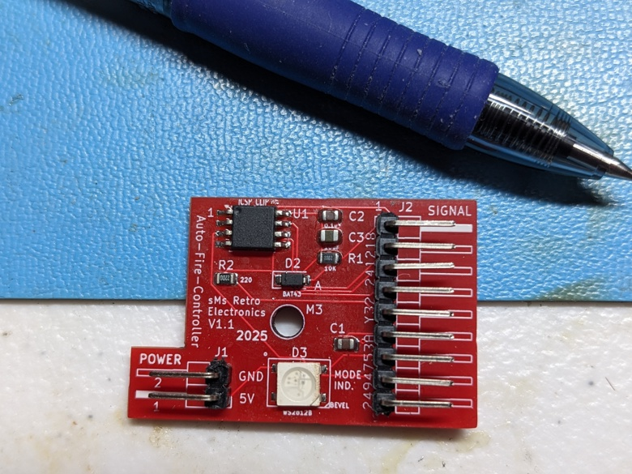
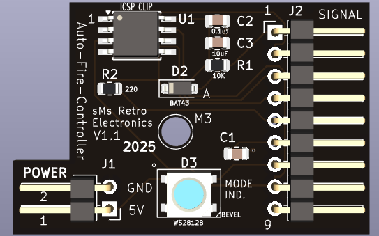
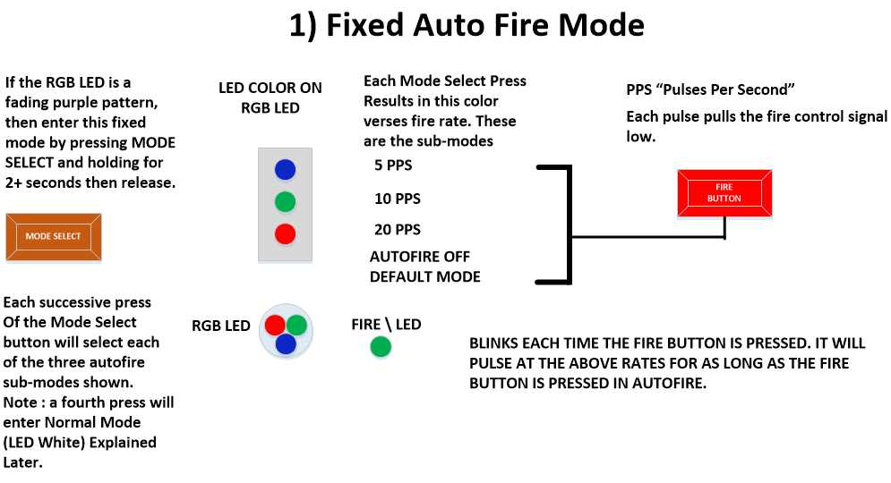
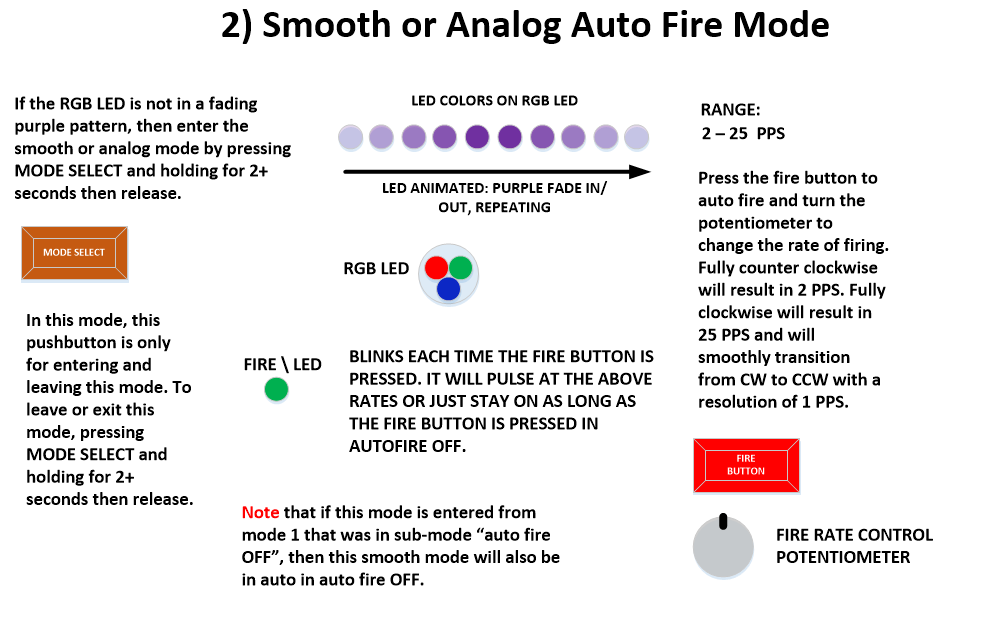
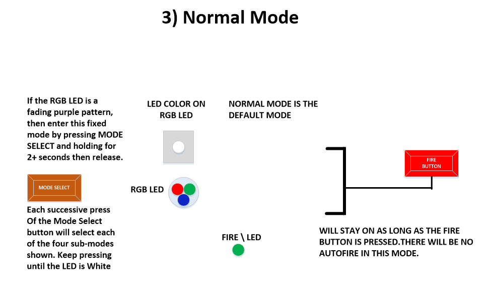
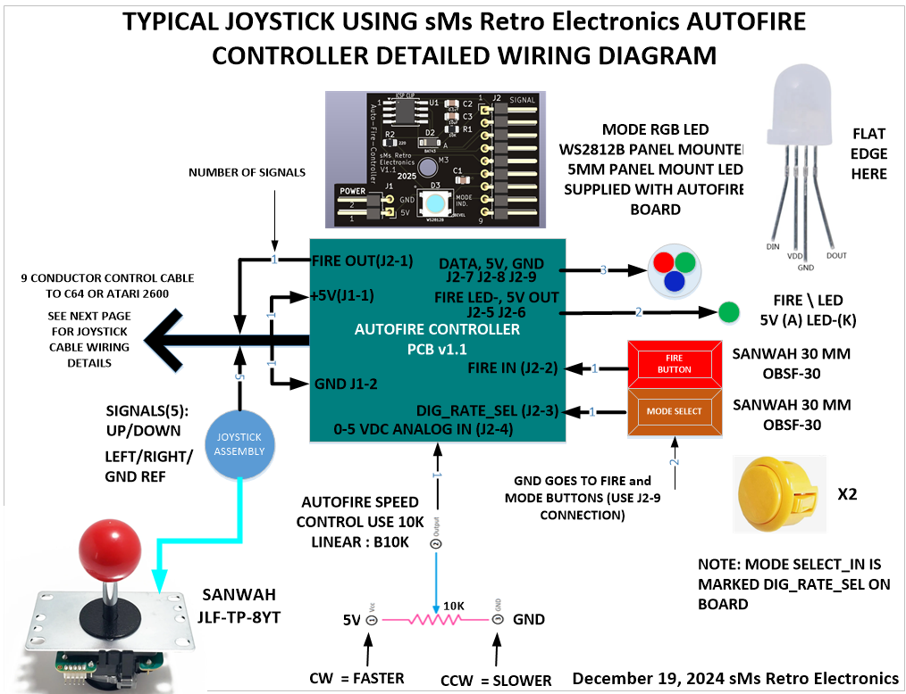
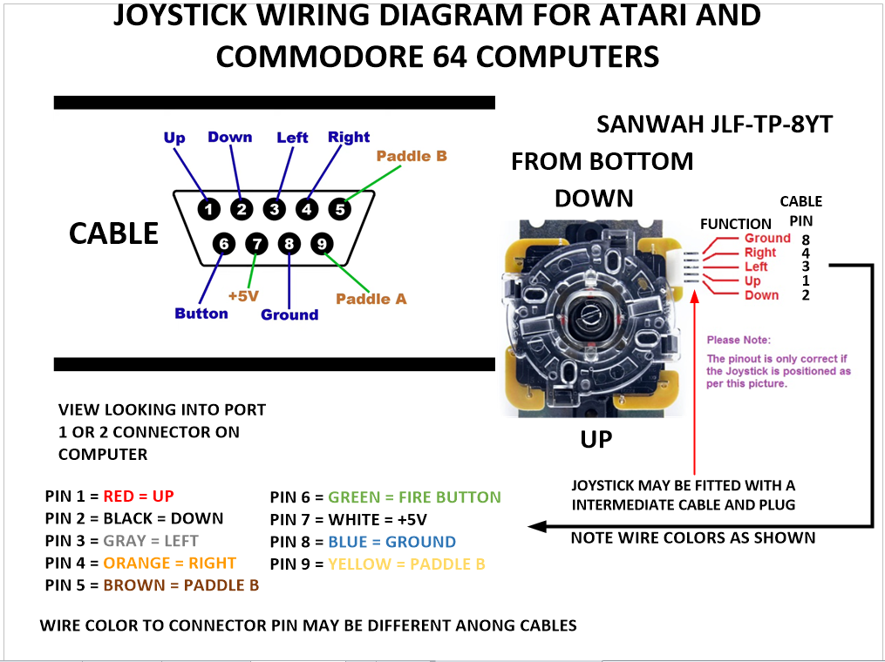

# Joystick Auto Fire Controller V1.1
 ### This is a small form factor digitally controlled auto fire PCB with 0.1" connector headers for convenient installation into Commodore 64 and Atari Joysticks. It can be used to create custom DIY joysticks. Fire rates can be controlled using a potentiometer (analog mode) to smoothly transition from fire rate from 2 to 25 pulses per second (PPS). Alternatively, you can enter a fixed rates mode (digital Mode) with a series of button presses. The fixed rate selections are 5, 10, and 15 PPS. A normal mode is also possible by disabling the auto fire in both scenarios above. All feedback is displayed on an RGB WS2812B compatible LED and FIRE LED. Various colors and fade animation are displayed representing all the modes and rates. Further below, these modes and how to enter them are described in the illustrations

 ## *The complete and tested auto fire controller PCB's, complete with documentation, are available on my sMs Retro Electronics KoFi Shop*

## [sMs Retro Electronics KoFi Shop](https://ko-fi.com/smsretroelectronics)

 ## Size of board compared to the end of a pen.  

 

 ## PCB TOP VIEW
 

 ## PCB BOTTOM VIEW
### A convenient silkscreen showing signal names NOTE: SQUARE PIN = 1

# J2 Signal Definitions: 

|Pin Number|Signal Name|Description|
|:--:|:--:|:--|
|1|/FIRE OUT|Active low signal output that emulates the trigger into the C64 or other computer to auto fire a weapon. This signal is normally HIGH. Signal wires to pin 6 of a joystick: 
|2|FIRE_BUT|Signal from fire control button on joystick. This signal pulls LOW each time the joystick fire button is pressed. This signal is normally HIGH. :
|3|DIGRATESEL|Selects the auto fire rate. Rates of 5, 10 and 20 PPS are selectable. A Quick press cycles theSE rates. A long press FOR 1.5+ seconds enables the analog rate control|   
|4|ANA_RATE|A 0-5 VDC input from external 10K potentiometer to vary the fire rate from 2 to 23 pulses per second. This potentiometer input is only active if the joystick is set to smooth analog fire control|
|5|Fire LED-|output for user option to mount external led to indicate the press of the fire button in normal mode or to indicate auto fire pulsing in either of two auto fire modes|
|6|VCC|supply for LED+. No limiting resistor is required|
|7|DATA IN|External Neopixel RGB LED Data IN Signal|
|8|VCC|5V supply for Neopixel|
|9|GND|Ground connection for Neopixel|

# J1 Signal Definitions: 

|Pin Number|Signal Name|
|:--:|:--|
|1|5V IN|
|2|GROUND| 
   
# Summary of Modes

- Fixed Auto fire Mode
- Smooth or Analog Fire 
- Normal Mode
  
# How to Enter and Operate Each Mode

 
  

 

# Typical application in a joystick design

# Joystick wiring details

The following diagram shows how to wire a Sanwah JLF-TP-8YT joystick , or compatible, assembly to a 9 PIN joystick cable. Some cables may be different in their color coding so its best to check continuity from each pin to the wires and identify the color verses pin. 

 
 
## If you want to DIY build your boards, the source files are available in the VS Code folder. Just keep in mind that when you create the project, inside the "libdeps" folder that contains the Tinbutton folder and TinyButton.cpp file. This file has been modifed to work with this project with the following changes. It was found that a long button press of 4 seconds was way too long and the long press woul dbe activated in 1.5 seconds instead.    

   ## Modification to file ***TinyButton.cpp*** to Shorten the LONG press criteria from 4 seconds to 1.5 seconds 
   ### W.Manganaro 2025
   
## FROM:    

      if ((currentMillis - _buttonPressTime) >= 4000)  
## TO:    
   

      //Value changed from 4000 to 1500 to validate a LONG press in a shorter time (approx 1.5 seconds)
      if ((currentMillis - _buttonPressTime) >= 1500) 

 